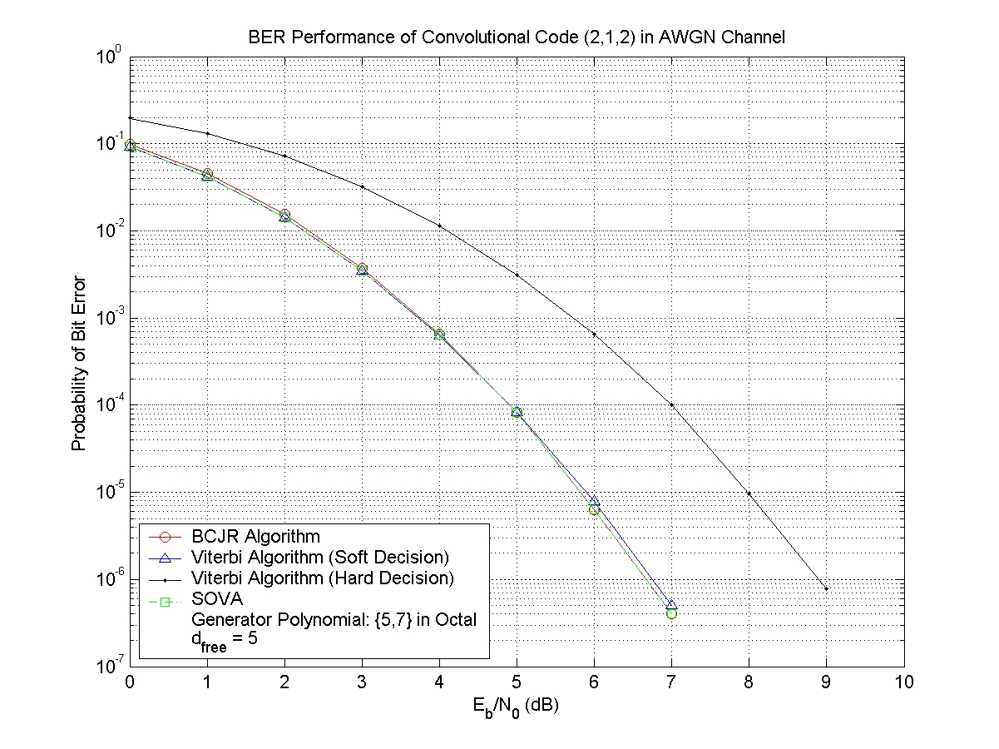
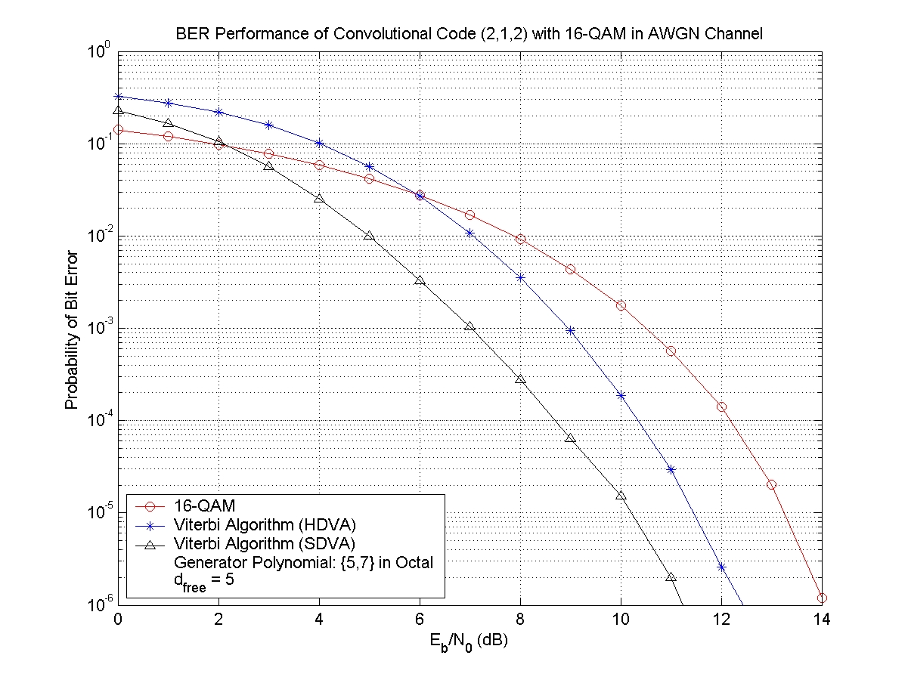
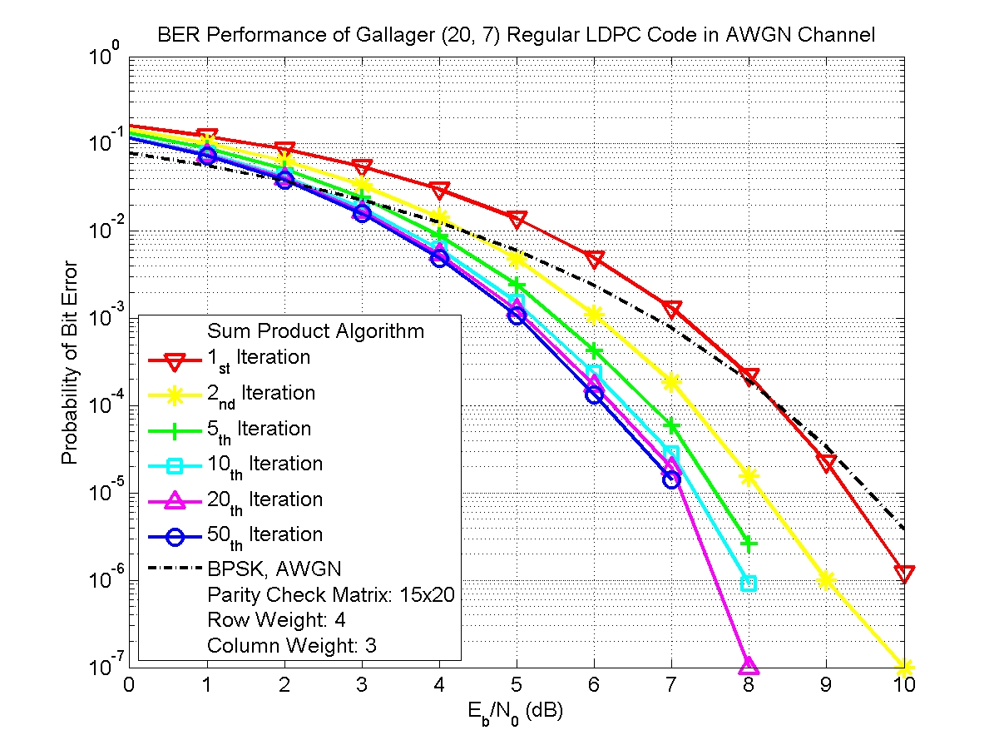
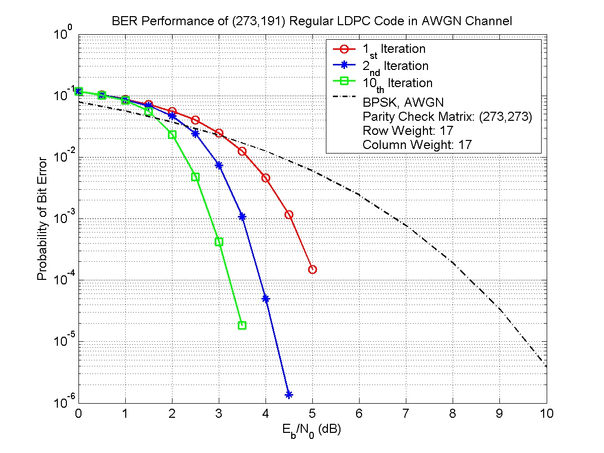

### Channel Coding

* Convolutional Code: MAP decoder, SOVA (Soft Output Viterbi Algorithm) decoder
* Galager Code: (20, 4, 3)
* LDPC Code: DSC(273, 17, 17)
* S-random Interleaver Generator

#### Performance Evaluation

